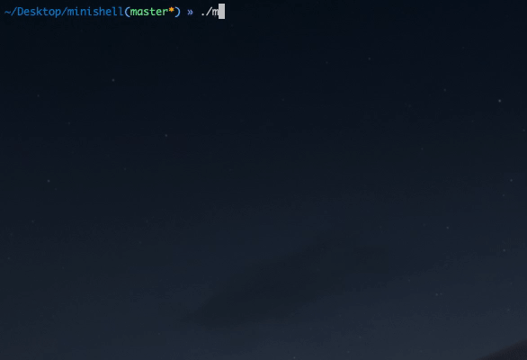

# Minishell - C - 2019  
As beautiful as a shell.  

  

## WeThinkCode:

**Mandatory:** 100/100  

### Team:  
[Ryan](https://github.com/Ryanhutchinson), [Ziad](https://github.com/ziadhorat), [Trevor](https://github.com/tkmaseleme) and [Marnus](https://github.com/mjbotes)    

## Installation:  
  
Clone the repo:  
  
```
git clone https://github.com/Ryanhutchinson/minishell  
cd minishell/Minishell
```  
Run the following to build the binary: ```make```  
  
## Running:  

#### Run the shell with:  
```./minishell```  

#### Exit the shell with:  
```exit```  
  
#### Cancel current process with:  
```Ctrl + C```

## Disclaimer:  
This project isn't perfect and is not maintained! Use my code at your own risk. I know of some flags and args not working.

## Don't be a Github Hero!
If you are a new _WeThinkCoder please do not copy and paste this work but feel free to use this as reference... be smart and not lazy! You won't learn anything by copy-pasting code. Thanks!
